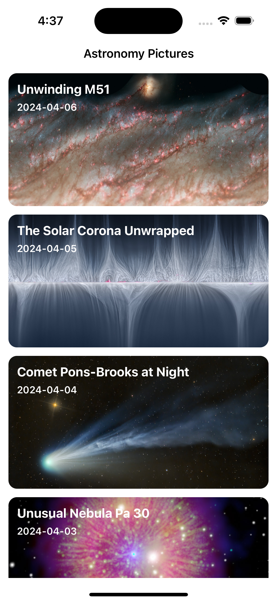
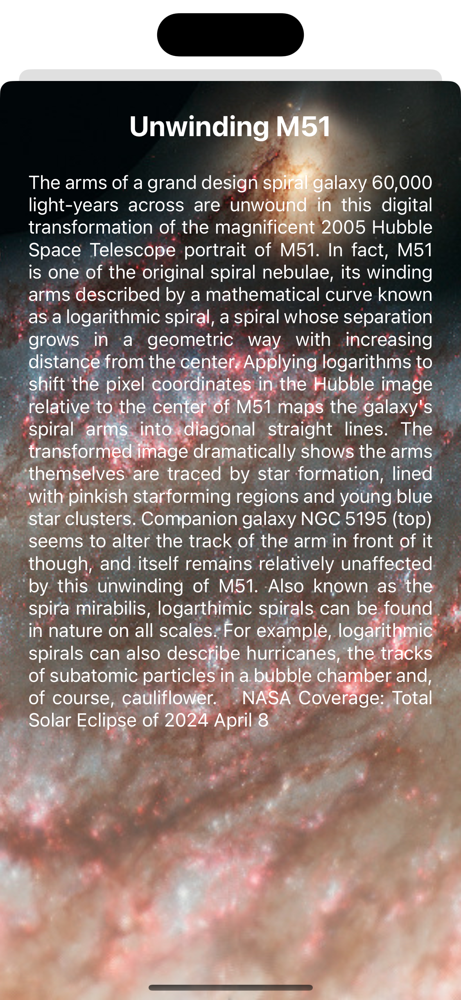

# Astronomy Pictures

## Introduction
This application showcases the Astronomy Picture of the Day (APOD), as provided by [NASA's APOD API](https://api.nasa.gov/). It offers users a list view of the latest astronomy pictures from the past 7 days, including their titles and capture dates. Tapping on a list item navigates to a detail view where users can see an enlarged image and read a detailed description.

## Architecture

- The **Model-View-ViewModel (MVVM)** pattern was adopted for its benefits in separating concerns, enhancing both the maintainability and testability of the code.

## Home Screen
- **Architecture**: MVVM
- Displays a list of Astronomy Pictures from the last 7 days using `UICollectionViewm`, `UICollectionViewDiffableDataSource`.
- Shows an alert popup in case of any errors.

## Detail Screen
- Displays the details of an Astronomy Picture.

## Network Layer
- A network layer was implemented using `URLSession` for fetching data.

## Caching
- Caching mechanisms were integrated using `NSCache` for images in memory.
- Disk caching is used to cache images in the Temporary folder.
- Disk caching is also used to cache data fetched from APIs.
